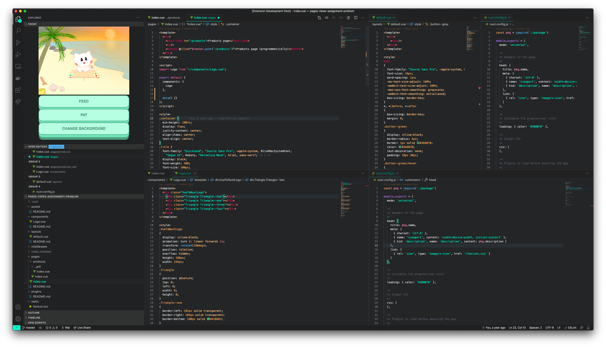
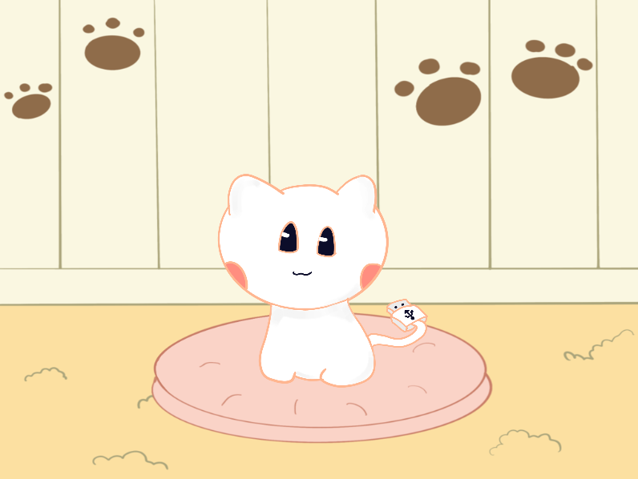
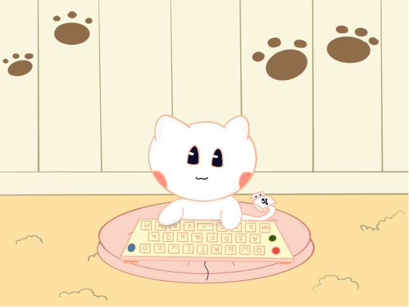
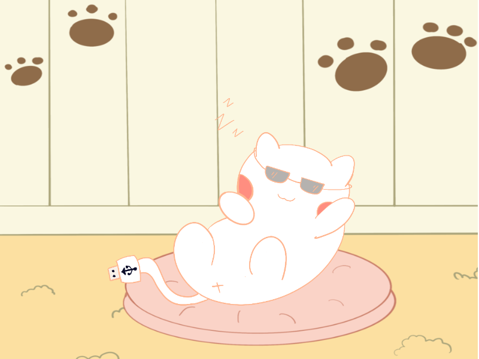
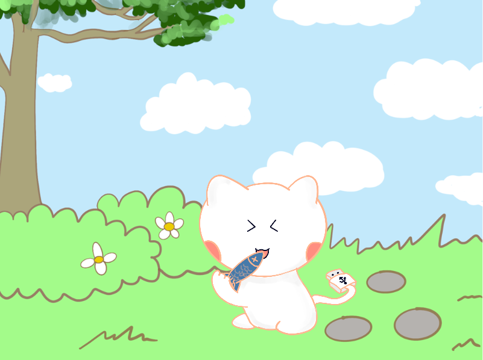
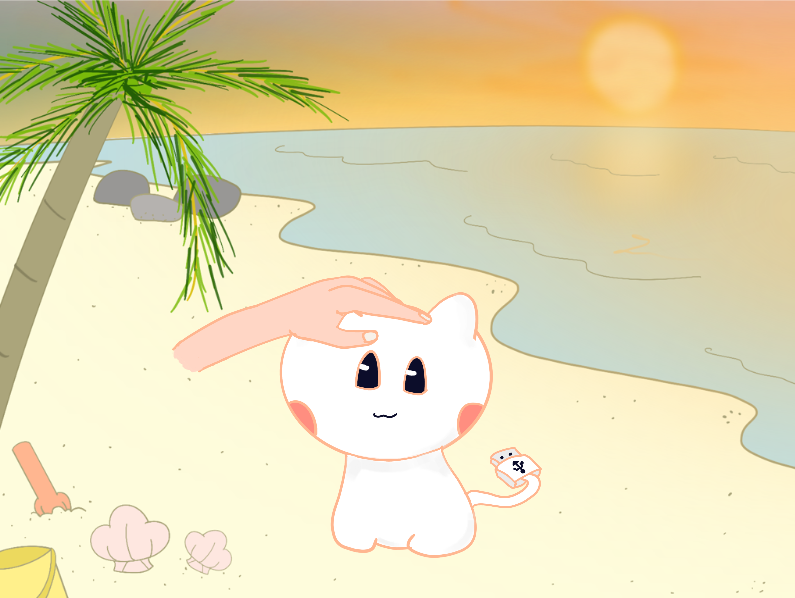
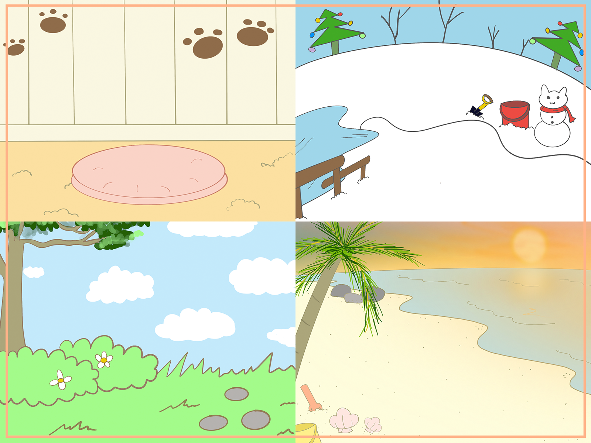

# VS Cat

VS Cat, short for Visual Studio Cat, is an interactive plugin for Visual Studio Code, where users can play with SoCCat (School of Computing Cat) while they use Visual Studio Code to write programs. Features include:
- Feeding SoCCat
- Patting SoCCat
- Bringing SoCCat out to different places
- Dragging SoCCat around the screen
- Changing state from Idle, Active, and Sleep, depending on whether user is actively typing code, idling for a while, or inactive in VS Code.

## Installation
1. Go to VS Code Extensions
2. Search for `VSCat` and install it
3. VSCat will now appear in your Explorer tab

## Functionalities

### Cat Idle (When you stop typing codes for 1 minute):

### Cat Active (When you start typing codes):

### Cat Sleep (When you are in Idle for more than 15 minutes):

### Feeding the Cat:

### Patting the Cat:

### Bringing the Cat out to tour:
Backyard, Snowy Village, Park, Beach

## Inspiration
As CS students ourselves, we use Visual Studio Code frequently. Hence, we wanted to make the VS Code environment more lively, instead of just staring at our boring codes all day. As such, we came up with an idea of adopting a Virtual Pet inside VS Code, where we can play with the Pet. Ideally, the Pet should also get hungry, grow in size, and provide feedback when we play with it (much like a Virtual Pet game). The most natural way to realize this idea is to create a VS Code Plugin so that we can see our Cat inside the IDE environment itself. We have decided to use Cat, specifically SoCCat, School of Computing Mascot Cat, as we think SoCCat is cute (who wouldn't love SoCCat?).

## Note
This is a Hackathon Project created in 24 hours for NUS HacknRoll 2021 entry. All codes (except forked boiler template for create-react-app in VS Code Plugin) are written from scratch during the hackathon. All graphic assets, including all Cats animations and backgrounds, are drawn from scratch during the Hackathon itself.

Author:
- Gan Chin Yao
- Lim Wai Lun

## Limitations
As this Project was created in 24 hours, bugs may be present.

## Future
Other functionalities we have in mind, but did not have the time to implement within 24 hours include:
- Cat gets hungry as time passed
- Cat ages and grows in size as time passed
- Dresses up the Cat, buy toys for Cat to play
- Stats for Cat, such as Love Meter, Boredom Meter
- More interaction feedback from Cat, different types of Cat

## Credits

This project was bootstrapped with 
* [VSCode Webview React](https://github.com/rebornix/vscode-webview-react)

from the author Rebornix, which gives us a base VS Code Plugin template that supports ReactJS create-react-app.
